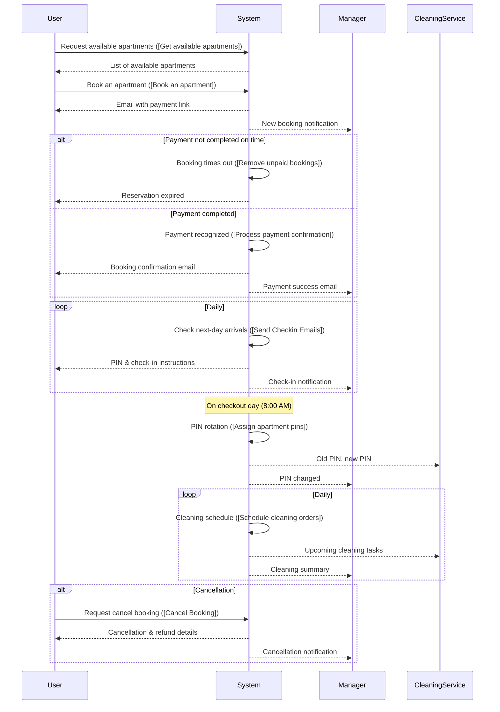
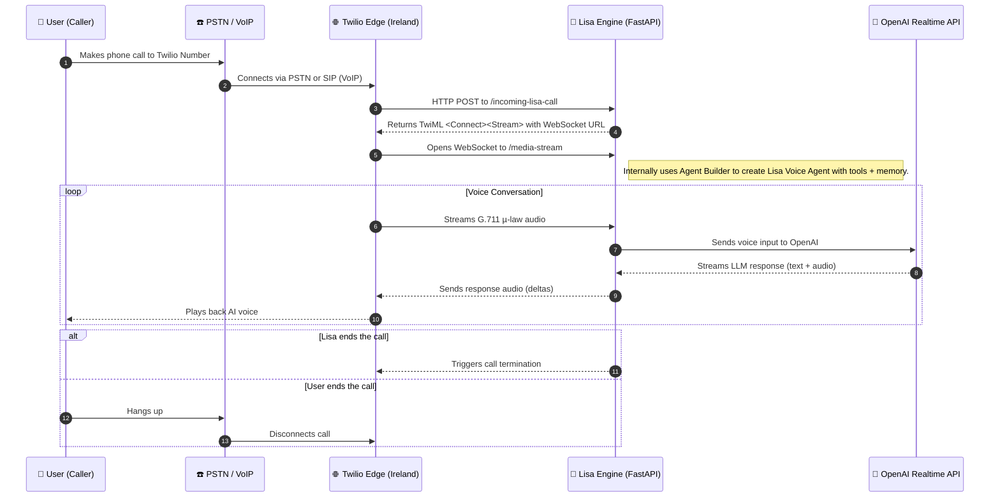

# 🏡 Guest Apartment Booking & Workflow Overview

This document provides a complete overview of our booking process—from the initial reservation request to payment, check-in, check-out, and cleaning procedures. It also covers the internal workflows (skills) powering these operations. A sequence diagram is included to illustrate how the process works end-to-end.

---

## 📚 Table of Contents

1. [High-Level Booking Process](#high-level-booking-process)  
2. [Key Workflows (Skills)](#key-workflows-skills)  
   - [Book an Apartment](#book-an-apartment)  
   - [Process Payment Confirmation](#process-payment-confirmation)  
   - [Send Checkin Emails](#send-checkin-emails)  
   - [Assign Apartment Pins](#assign-apartment-pins)  
   - [Schedule Cleaning Orders](#schedule-cleaning-orders)  
   - [Cancel Booking](#cancel-booking)  
   - [Other Relevant Workflows](#other-relevant-workflows)  
3. [Detailed Flow: From Reservation to Checkout](#detailed-flow-from-reservation-to-checkout)  
4. [Sequence Diagram](#sequence-diagram)  
5. [Workflow Input/Output Summaries](#workflow-inputoutput-summaries)  

---

## 🧭 High-Level Booking Process

1. **Reservation Request & Payment Link**  
   - Customer provides arrival/departure dates and number of guests  
   - System checks availability and tentatively reserves an apartment  
   - Payment link is generated and sent  
   - Property manager is notified  

2. **Payment Completion & Booking Confirmation**  
   - On successful payment, booking is marked as “confirmed”  
   - Confirmation emails sent to customer and manager  
   - Access PIN/key sent if check-in is imminent  

3. **Pre-Check-in Coordination**  
   - One day before arrival, check-in workflow is triggered  
   - Guest receives email with PIN/code and instructions  
   - Manager is notified  

4. **Checkout & Cleaning**  
   - On checkout day, new PIN is generated  
   - Cleaning service is instructed to rotate the code  
   - Daily cleaning-forecast workflow is run  

5. **Cancellation Handling (If Needed)**  
   - Booking is marked “cancelled”  
   - Refund initiated (if payment was made)  
   - Notifications sent to customer and manager  

---

## ⚙️ Key Workflows (Skills)

### ✅ Book an Apartment
- **Trigger:** User initiates a booking  
- **Purpose:** Create reservation, calculate price, and send payment link  
- **Actions:**
  1. Reserve apartment  
  2. Send payment link to customer  
  3. Notify manager  

### 💳 Process Payment Confirmation
- **Trigger:** Stripe confirms payment  
- **Purpose:** Mark booking as “confirmed”  
- **Actions:**
  1. Update booking status  
  2. Send confirmation to customer (with PIN if necessary as if the booking is done a day prior or same day of checkin.)  
  3. Notify manager  

### ✉️ Send Checkin Emails
- **Trigger:** Daily job for next-day arrivals  
- **Purpose:** Share PIN and check-in instructions with guests  
- **Actions:**
  1. Identify upcoming arrivals  
  2. Email PIN & instructions  
  3. Notify manager  

### 🔐 Assign Apartment Pins
- **Trigger:** Daily at 8:00 AM  
- **Purpose:** Assign new PINs for checkouts  
- **Actions:**
  1. Identify checkouts  
  2. Generate and email new PINs to cleaning service  
  3. Notify manager  

### 🧹 Schedule Cleaning Orders
- **Trigger:** Daily, for next 6 days  
- **Purpose:** Schedule cleaning tasks  
- **Actions:**
  1. Scan upcoming checkouts  
  2. Schedule tasks and email cleaning service  
  3. Send summary to manager  

### ❌ Cancel Booking
- **Trigger:** Customer or manager initiates  
- **Purpose:** Cancel booking and issue refund  
- **Actions:**
  1. Update booking status  
  2. Trigger refund if paid  
  3. Notify customer, cleaning service (if cleaning order created) and manager  

### 🔎 Other Relevant Workflows
- **Get available apartments** – Check available listings  
- **Fetch existing customer details** – Lookup by email  
- **Create new customer** – Create customer record  
- **Remove unpaid bookings** – Clean up expired, unpaid reservations  
- **Email Manager** – Escalate or share updates  
- **Explore Guests Apartments Website Content** – Fetch content/FAQs from website  

---

## 🔄 Detailed Flow: From Reservation to Checkout

1. **User Checks Availability**  
   → `[Get available apartments]`

2. **User Submits a Reservation**  
   → `[Book an apartment]`  
   → Email payment link  
   → Notify manager  

3. **Payment Received**  
   → `[Process payment confirmation]`  
   → Booking confirmed  
   → Email confirmation and optional PIN  

4. **Arrival Preparation**  
   → `[Send Checkin Emails]` (1 day before)  
   → Email guest and notify manager  

5. **Checkout Day**  
   → `[Assign apartment pins]` (8:00 AM)  
   → Email PINs to cleaning service  
   → Notify manager  

6. **Cleaning Schedule**  
   → `[Schedule cleaning orders]`  
   → Email schedule to cleaning and manager  

7. **Cancellation (Optional)**  
   → `[Cancel Booking]`  
   → Refund + notifications  

---

## 🧬 Sequence Diagram

# 📞 Twilio based voice call Architecture

This project enables a user to call a Twilio number, which triggers a voice agent built on a FastAPI backend. It uses **Twilio Media Streams**, **WebSocket-based audio streaming**, and **OpenAI's Realtime API** to have dynamic conversations with users over the phone.

---
## 🧠 Architecture Overview

# 🧩 Components

## 📱 User (Caller)
- Initiates the voice call from a mobile, landline, or SIP client.
- Just uses a regular phone app — no installation needed.

## ☎️ PSTN / VoIP
- Traditional telecom network (PSTN) or internet-based SIP protocols used to deliver the call to Twilio.

## 🌐 Twilio Edge Server (Ireland)
- Receives the incoming call.
- Calls the webhook (`/incoming-lisa-call`) to get streaming instructions.
- Opens a WebSocket stream with `/media-stream` as specified in returned TwiML.

## 🤖 Lisa Engine (FastAPI App)
Main AI backend that powers the conversation.

**Endpoints:**
- `POST /incoming-lisa-call` — returns TwiML to Twilio
- `WebSocket /media-stream` — handles audio input/output

**Internally uses:**
- `Voice Agent Builder` to construct Lisa with tools, memory, and OpenAI access.
- `RequestProcessor` to coordinate actions from audio input.

## 💬 OpenAI Realtime API
- Receives streaming voice input from Lisa Engine.
- Responds with real-time text + audio.
- Audio output format: `g711_ulaw` to match Twilio.

---

# 🔁 Conversation Flow Summary
1. User calls Twilio number from any phone.
2. Twilio routes call to your FastAPI endpoint.
3. TwiML is returned by `/incoming-lisa-call` with instructions to open a WebSocket.
4. WebSocket opens between Twilio and `/media-stream`.
5. Lisa builds a voice agent via the Agent Builder.
6. Twilio streams user audio (G.711 µ-law) over WebSocket.
7. Lisa sends input to OpenAI using real-time WebSocket.
8. OpenAI responds with text and audio.
9. Lisa sends back audio deltas to Twilio.
10. Twilio plays it back to the user.
11. Loop continues until user or agent ends the call.

---

# 🔊 Audio Format
- **Twilio uses:** G.711 µ-law (base64-encoded)
- **Lisa outputs:** G.711 µ-law deltas back to Twilio
- **OpenAI input/output:** Adapted via JSON WebSocket stream

---

# ❌ Call Termination
- **User ends the call:** PSTN disconnect triggers teardown.
- **Lisa ends the call:**
  - Triggers `"call.end"` event.
  - Lisa raises `CallEndException` in FastAPI.
  - WebSocket closes cleanly.

---

# 🧪 Development Notes
- You can test locally using **ngrok** to expose the FastAPI server.
- Use a real Twilio number with **Media Streams enabled**.
- Check logs for:
  - `streamSid`, `callSid`
  - Twilio `"start"`, `"media"`, `"stop"` events
- Clean up long-lived WebSocket connections properly to avoid memory leaks.

---

# 📁 Related Files
- `lisa_engine.py` — FastAPI handlers (`/incoming-lisa-call`, `/media-stream`)
- `build_lisa_voice_agent` — Voice agent factory with OpenAI, tools, and memory
- `RequestProcessor` — Handles user utterances and tool use
- `CallEndException` — Custom exception to end the call safely

---

# 📬 Contact
**Built by:** Aniket Jha | Chief AI Scientist  
✉️ aniket.jha@recall.space
🌍 Mannheim, Germany
